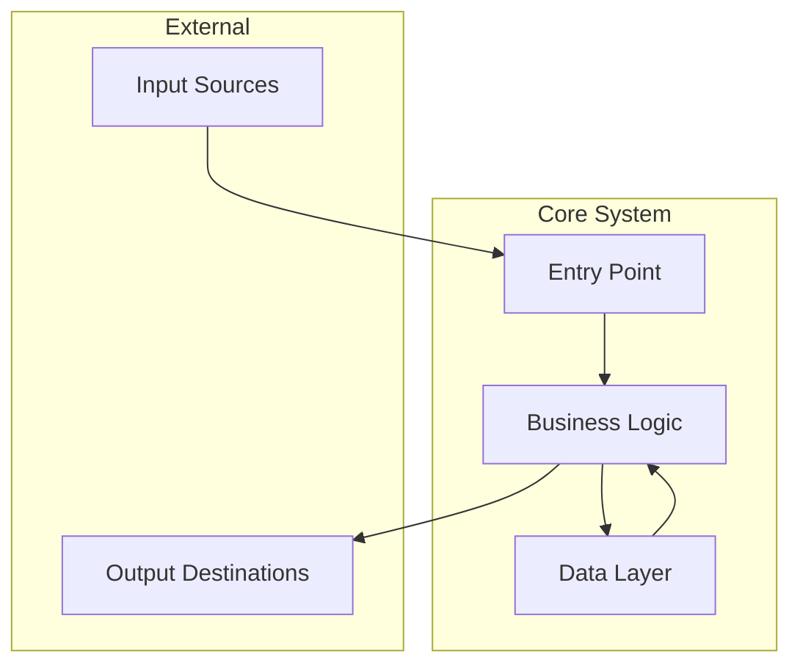

# Universal Repository Investigation Prompt

I need to perform a comprehensive deep-dive investigation into this repository. Please follow this structured analysis plan and **ensure complete coverage of ALL files**.

---

## 🛡️ COVERAGE GUARDRAILS (MANDATORY)

Before proceeding with analysis, you MUST complete these verification steps:

### Pre-Investigation Checklist
- [ ] Execute `find . -type f | wc -l` to get total file count
- [ ] Execute `find . -type d | wc -l` to get total directory count
- [ ] Create a tracking list of ALL directories to visit
- [ ] Document the root-level structure completely

### Coverage Tracking Protocol
After each phase, you MUST report:
```
📊 COVERAGE STATUS:
- Files discovered: X/Y total
- Directories explored: X/Y total
- Files read: X (list them)
- Files pending: X (list them)
```

### Completion Gate
**DO NOT proceed to Output Requirements until:**
- [ ] Every directory has been listed and examined
- [ ] Every code file has been read (at minimum: entry points, core modules, configs)
- [ ] Every configuration file has been analyzed
- [ ] Every README/documentation file has been reviewed

---

## Phase 1: Reconnaissance & Scope

### 1.1 Repository Discovery
1. **Root Inventory**: List the complete root directory structure
2. **Documentation Scan**: Read ALL README.md, CONTRIBUTING.md, docs/, or similar documentation files at any level
3. **Recursive Mapping**: Execute `find . -type f -name "*.md" -o -name "*.txt" -o -name "*.rst"` to find all documentation
4. **Structure Analysis**: Generate complete directory tree with `tree -L 4` or equivalent

### 1.2 Technology Detection
Identify the tech stack by searching for these indicators:

| Category | Files to Check |
|----------|---------------|
| **Python** | `pyproject.toml`, `setup.py`, `requirements.txt`, `Pipfile`, `poetry.lock`, `*.py` |
| **JavaScript/TypeScript** | `package.json`, `tsconfig.json`, `*.js`, `*.ts`, `*.jsx`, `*.tsx` |
| **Go** | `go.mod`, `go.sum`, `*.go` |
| **Rust** | `Cargo.toml`, `Cargo.lock`, `*.rs` |
| **Java/Kotlin** | `pom.xml`, `build.gradle`, `*.java`, `*.kt` |
| **Ruby** | `Gemfile`, `*.rb` |
| **C/C++** | `CMakeLists.txt`, `Makefile`, `*.c`, `*.cpp`, `*.h` |
| **.NET** | `*.csproj`, `*.sln`, `*.cs` |

### 1.3 Project Layout Classification
Determine the project type:
- **Monorepo**: Multiple packages/services in subdirectories
- **Library/Package**: Publishable reusable code
- **Application**: Runnable service or executable
- **Framework**: Extensible development platform
- **Infrastructure**: IaC, CI/CD, deployment configs
- **Hybrid**: Combination of above

**🔒 CHECKPOINT 1**: Before proceeding, confirm:
- [ ] All root-level files listed
- [ ] All documentation files identified and queued for reading
- [ ] Tech stack determined
- [ ] Project type classified

---

## Phase 2: Architecture & Lifecycle

### 2.1 Build & Deployment Analysis
Search for and READ these files (if present):

**Containerization:**
- `Dockerfile`, `docker-compose.yml`, `docker-compose.*.yml`
- `.dockerignore`
- Container orchestration: `kubernetes/`, `k8s/`, `helm/`, `charts/`

**CI/CD:**
- `.github/workflows/*.yml` (GitHub Actions)
- `.gitlab-ci.yml` (GitLab CI)
- `Jenkinsfile`, `.jenkins/`
- `.circleci/config.yml`
- `.travis.yml`
- `azure-pipelines.yml`
- `bitbucket-pipelines.yml`

**Build Systems:**
- `Makefile`, `justfile`, `Taskfile.yml`
- `package.json` scripts section
- `pyproject.toml` scripts/build sections
- `build.sh`, `build/`, `scripts/`

### 2.2 Configuration Analysis
Locate and READ all configuration:

**Environment & Secrets:**
- `.env`, `.env.example`, `.env.*`
- `config/`, `conf/`, `settings/`
- `*.yaml`, `*.yml`, `*.toml`, `*.json`, `*.ini` in config directories

**Application Config Patterns:**
- Python: `settings.py`, `config.py`, Pydantic models, dynaconf
- Node.js: `config/`, `convict`, `dotenv` usage
- Go: `viper` configs, `config.go`
- Java: `application.properties`, `application.yml`

### 2.3 Dependency Analysis
**READ and analyze:**
- Lock files for exact versions
- Dependency tree structure
- Internal vs external dependencies
- Development vs production dependencies

**🔒 CHECKPOINT 2**: Before proceeding, confirm:
- [ ] All CI/CD configurations read
- [ ] All Dockerfiles/container configs read
- [ ] All environment/config files read
- [ ] Dependency files analyzed

---

## Phase 3: Code Logic Analysis

### 3.1 Entry Point Discovery
Find and READ the main entry points by pattern:

**Common Entry Points:**
- Python: `main.py`, `app.py`, `__main__.py`, `wsgi.py`, `asgi.py`, `manage.py`
- Node.js: `index.js`, `index.ts`, `app.js`, `server.js`, `main.ts`
- Go: `main.go`, `cmd/*/main.go`
- Java: `*Application.java`, `Main.java`
- Rust: `main.rs`, `lib.rs`

**Package Entry Points:**
- Check `package.json` → `main`, `module`, `exports`
- Check `pyproject.toml` → `[project.scripts]`, `[tool.poetry.scripts]`
- Check `setup.py` → `entry_points`

### 3.2 Core Logic Tracing
For EACH major module/component:

1. **Read the module's entry file** (e.g., `__init__.py`, `index.ts`, `mod.rs`)
2. **Identify exported functions/classes**
3. **Trace the main execution flow**
4. **Document public APIs and interfaces**

**Execution Patterns to Identify:**
- Request/Response handlers (HTTP, gRPC, GraphQL)
- Event listeners/subscribers
- Background workers/jobs
- CLI command handlers
- Scheduled tasks/cron jobs
- Database migrations
- Plugin/extension systems

### 3.3 Integration & Communication
Search for and analyze:

**External Communication:**
- HTTP clients: `requests`, `axios`, `fetch`, `http.Client`
- gRPC: `.proto` files, generated stubs
- Message queues: Kafka, RabbitMQ, Redis pub/sub
- Database connections: ORMs, raw SQL, connection configs

**Internal Module Communication:**
- Import/export patterns
- Dependency injection
- Event buses
- Shared state/singletons

### 3.4 Testing Strategy
Locate and understand test structure:
- `tests/`, `test/`, `__tests__/`, `*_test.go`, `*.spec.ts`
- Test frameworks used
- Test coverage configuration
- Integration vs unit test separation

**🔒 CHECKPOINT 3**: Before proceeding, confirm:
- [ ] All entry points identified and read
- [ ] Core business logic modules read
- [ ] Integration patterns documented
- [ ] Test structure understood

---

## 🔒 FINAL VERIFICATION GATE

Before generating the Output Report, you MUST complete this verification:

### File Coverage Audit
```
📋 MANDATORY FILE COVERAGE REPORT:

Documentation Files Read:
- [ ] List each README, CONTRIBUTING, docs file

Configuration Files Read:
- [ ] List each config, env, yaml, json file

Entry Point Files Read:
- [ ] List each main entry point file

Core Logic Files Read:
- [ ] List each major module/component file

Test Files Reviewed:
- [ ] List test configuration and sample test files

Build/Deploy Files Read:
- [ ] List Dockerfile, CI/CD, Makefile files

TOTAL FILES READ: X
TOTAL FILES IN REPO: Y
COVERAGE: X/Y (Z%)
```

### Unread Files Justification
If any files were NOT read, you MUST provide justification:
- Generated files (e.g., `*.pyc`, `node_modules/`, `dist/`)
- Binary files (e.g., images, compiled assets)
- Vendor/dependency directories
- Lock files (after confirming version review)

---

## Output Requirements

Please provide a comprehensive summary report with the following sections:

### 1. Executive Summary
- **Repository Purpose**: What does this codebase do? (2-3 sentences)
- **Tech Stack**: Languages, frameworks, and key libraries
- **Architecture Pattern**: Monolith, microservices, serverless, etc.

### 2. Repository Structure Map
```
repository-root/
├── [describe purpose of each top-level directory]
├── [key files and their roles]
└── ...
```

### 3. Key Files Index
| File | Purpose | Priority |
|------|---------|----------|
| `path/to/file` | Description | Critical/Important/Reference |

### 4. Data Flow Diagram
Describe how data enters, transforms, and exits the system:
- **Inputs**: APIs, files, events, user actions
- **Processing**: Core transformations and business logic
- **Outputs**: Responses, files, events, side effects
- **Storage**: Databases, caches, file systems

### 5. Component Interaction Diagram (Mermaid)


### 6. Integration Points
| Integration | Type | Direction | Protocol |
|-------------|------|-----------|----------|
| External Service | API | Outbound | HTTP/gRPC |
| Database | Storage | Bidirectional | SQL/NoSQL |
| Message Queue | Event | Pub/Sub | Kafka/AMQP |

### 7. Development Workflow
- **Setup**: How to get the project running locally
- **Build**: How to compile/bundle the project
- **Test**: How to run tests
- **Deploy**: How the project is deployed

### 8. Observations & Recommendations
- **Strengths**: Well-designed aspects
- **Areas for Improvement**: Potential refactoring opportunities
- **Security Considerations**: Noted security patterns or concerns
- **Documentation Gaps**: Missing or outdated documentation

---

## Appendix: Investigation Log

Maintain a running log of your investigation:

```
🔍 INVESTIGATION LOG:

[Timestamp] Phase 1 Started
- Discovered X files, Y directories
- Tech stack: [languages/frameworks]

[Timestamp] Phase 2 Started
- Build system: [type]
- CI/CD: [platform]

[Timestamp] Phase 3 Started
- Entry points: [list]
- Core modules: [list]

[Timestamp] Investigation Complete
- Total files read: X
- Total coverage: Y%
```